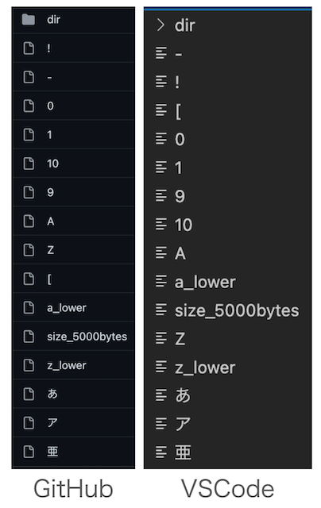
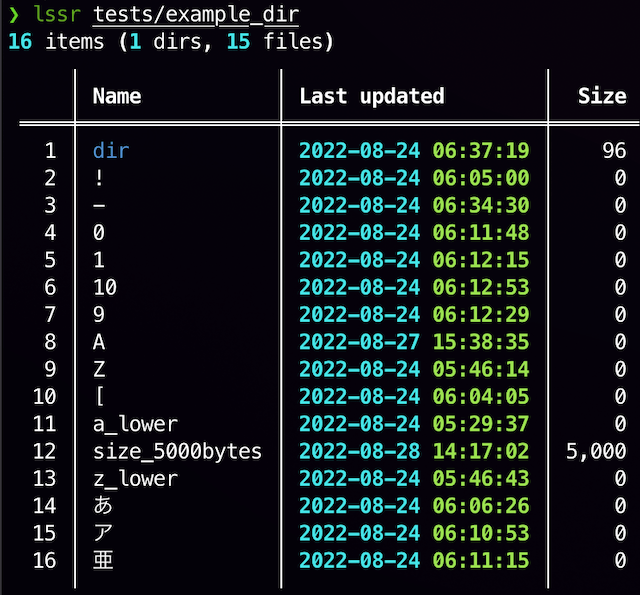

:::note info
本記事では、フォルダ（ディレクトリ）とファイルを総称して **アイテム** と呼びます。
:::

GitHub では、

- フォルダ -> ファイル
- Unicode

の順にアイテムがソートされ、この順番は変更できないようです（公式での記載は見つかりませんでしたが、おそらくそう）。

よって、GitHub の並び順に合わせることとします。

## Visual Studio Code の設定

デフォルトでは並び順が異なります。



VSCode の `設定` から、`Explorer: Sort Order Lexicographic Options` を `default` から `unicode` に変更することで、GitHub での並び順と同一になります。

`settings.json` を直接編集する場合は、以下を追記します。

```jsonc:settings.json
{
  // その他の設定...
  "explorer.sortOrderLexicographicOptions": "unicode"
}
```

## ターミナルアプリ

ターミナルアプリはプラットフォームによって異なるので、Mac に標準搭載されている `ls` コマンドで考えてみました。

しかし、Linux では `ls --group-directories-first` とすれば `フォルダ -> ファイル` が実現できるようですが、Mac の `ls` には当該オプションが搭載されていないようです。

- `ls -AFl` の結果をパイプで加工する
- シェルスクリプトを書く
- 外部コマンドをインストールする

などの方法が考えられますが、結局 OS による違いを考慮しなければならず付け焼き刃感が否めないので、この際 Python でクロスプラットフォームかつ自分好みな `ls` コマンドの再開発をしてみました。

https://github.com/seijinrosen/lssr

当初の目的である並び順については、Python の文字列の扱いが Unicode なので、`sorted(pathlib.Pathオブジェクト.iterdir(), key=lambda p: (p.is_file(), p.name))` とするだけで実現できました。



今のところ、自分の用途では便利に使えています。もしよければ使ってみてください。
